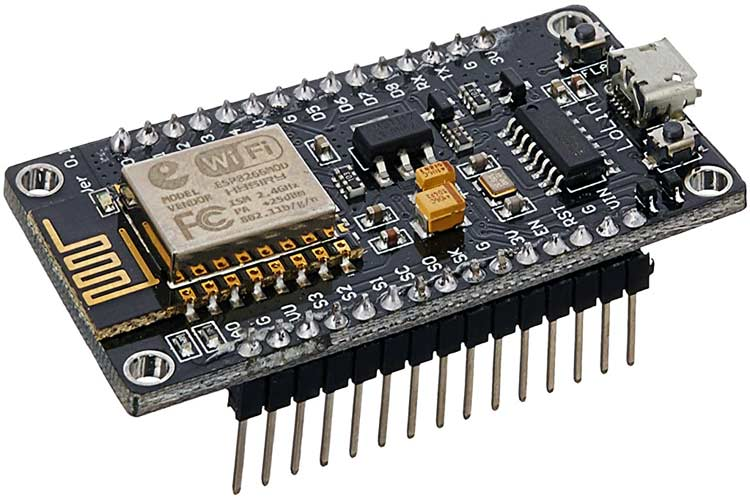

# CPE405-HW1-61012139

ตัวกล่อง

ฐานล่างสำหลับน็อตยึดกำแพง จะตั้งไว้ที่ 98mm x 168mm รูน็อตขนาด 2-2.5mm 

ต่อมาตัวกล่องจะทำขึ้นสูงมา 20mm(รวมฐานยึด 23mm) และตัวกล่องจะมีขนาด 76mm x 136mm ขอบหนา 2mm

ด้านในจะมีพื้นที่ประมาณ 72mm x 132mm เนื่องจากมีฐานใส่น็อตด้านใน 6mm x 6mm

รูน็อตสำรับยึดกับฝา 2.5mm

รูสำหรับDCและrelay 

ตัวฝา

ขนาดจะเท่ากับกล่องคือ 76mm x 136mm 

ส่วนด้านในฝาจะเหมือนกับกล่องจะมีนื้อที่ประมาณ 72mm x 132mm ขนาดรูน็อต 2.5mm

และสูง 10mm(รวมความหนา 12mm)

ขนาดรูของ DHT22 15.1mm x 20mm

ขนาดรูของ botton switch 9.2mm x 13.2mm 

ขนาดรูของ LED เส้นผ่าศูนย์กลาง 4.75mm 

อ้างอิงขนาดเจาะรูและใส่อุปกรณ์

DC

DHT22

LED

Photo board

Relay

Switch botton

NODEMCU

ออกแบบคราวๆ

